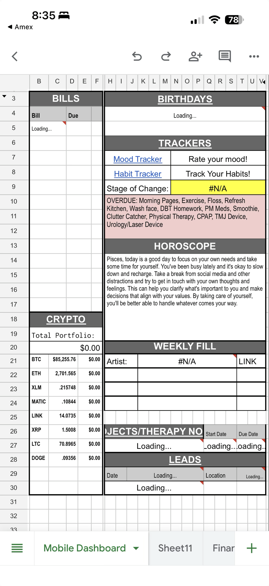

# Mobile Dashboard stuck on "Loading..."

Captured 2026-10-04 on iPhone (Google Sheets app, "Mobile Dashboard" tab).
This is what the dashboard **usually** looks like on open: it sits on
"Loading..." and never fills in.

## What's broken in the screenshot

| Section | Shows | Notes |
|---|---|---|
| Bills (B5) | `Loading...` | red error triangle on the cell |
| Birthdays (H4) | `Loading...` | red triangle |
| Projects/Therapy Notes, Start/Due Date (row 27) | `Loading...` | red triangles |
| Leads (rows 29–30) | `Loading...` | red triangles |
| Stage of Change | `#N/A` | lookup found nothing |
| Weekly Fill → Artist | `#N/A` | red triangle |
| Crypto holdings | `$0.00` everywhere | prices load fine, holdings/total don't |

Working fine: Trackers links, Overdue habits list, Horoscope, crypto prices.

## Things to check on the laptop

1. Hover each red triangle and write down the exact error text.
2. Click a `Loading...` cell and see its formula. "Loading..." usually means
   `IMPORTRANGE`, `IMPORTXML`/`IMPORTDATA`, or a custom Apps Script function
   (`=SOMETHING()` from Extensions → Apps Script).
   - `IMPORTRANGE`: may need "Allow access" clicked once on desktop.
   - Custom functions: they time out after ~30s and the mobile app is worse at
     re-running them; check Apps Script → Executions for errors.
3. Trace the `#N/A` cells back to their lookup (`VLOOKUP`/`XLOOKUP`/`MATCH`) –
   possibly depend on one of the stuck cells above.
4. Crypto `$0.00`: check where the quantity column comes from (likely the same
   broken source).
5. Compare with how it looks on desktop – if it loads there, it's a mobile
   recalculation issue; if not, it's the formulas/sources themselves.

## Related: Apple Watch habit tracker work

Same spreadsheet family as the habit tracker sheet worked on in the Claude Code
session "Apple Watch habit tracker with smart skip logic" (last worked
2026-09-03, on the laptop). The dashboard's **Habit Tracker** link and
**OVERDUE** list pull from that sheet, and those parts work fine. The
"Loading..." cells are Bills/Birthdays/Projects/Leads, so they probably come
from a different source.

Where that session left off:
1. Finish the AU-column format touch-up (copy `AU21` → Paste special → Format
   only into `AU22:AU58`) on Template + the other 11 month tabs (September is
   already done).
2. Then Daily/Weekly/Monthly are complete everywhere → next phase is the
   Year Overview tab (Quarterly / Semi-Annual / Annual).

When you're back on the laptop, you can resume that session and paste this
note in, or tackle both in one session.
